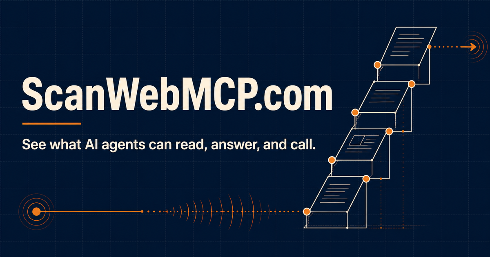

# ScanWebMCP.com

<p align="center">
  <a href="https://www.scanwebmcp.com/">
    
  </a>
</p>

[](https://github.com/Niftyzio/scanwebmcp/actions/workflows/ci.yml)
[](https://www.scanwebmcp.com/)
[](https://www.scanwebmcp.com/openapi.json)
[](https://www.scanwebmcp.com/mcp)
[](https://ora.ai/score/scanwebmcp.com)
[](LICENSE)

**ScanWebMCP.com shows what an AI agent can actually do with a public website today—not what a manifest claims it might do.**

Enter a URL and receive a dated, evidenced assessment of what agents can **read**, **answer**, and **call**. The scanner validates public content, crawler access, structured data, APIs, MCP endpoints, and live browser-registered WebMCP tools against the published [Agent Surface Ladder v1.0](content/ladder.md).

**[Scan a website](https://www.scanwebmcp.com/)** · [See the methodology](https://www.scanwebmcp.com/ladder) · [Explore the Observatory](https://www.scanwebmcp.com/observatory) · [Build with the API](https://www.scanwebmcp.com/developers)

## Why ScanWebMCP is different

Most scanners stop when they find a URL, tag, script, or manifest. ScanWebMCP verifies the behavior behind it.

| A weak scanner might count… | ScanWebMCP requires… |
| --- | --- |
| An HTTP 200 | Content that is valid for the surface being tested—not a login page, HTML error, or WAF challenge |
| An MCP-looking URL | A successful MCP `initialize` and `tools/list` exchange that returns real tools |
| A WebMCP script or manifest | Tools witnessed in a live browser registry, with names, schemas, annotations, and page context |
| An unreachable signal as zero | An explicit **unmeasured** result, so infrastructure failure never becomes a false finding |
| A transactional declaration | A separately consented end-to-end invocation before awarding Transactable |
| A generic recommendation | Timestamped evidence, the exact source URL, and a next action tied to the weakest dimension |

The result is an evidence trail that a business owner, developer, or AI agent can inspect and act on.

## The Agent Surface Ladder

Every completed scan is placed on the highest rung it fully satisfies:

| Rung | Name | Meaning |
| ---: | --- | --- |
| 0 | **Invisible** | Agents are blocked or cannot reliably retrieve the core content. |
| 1 | **Readable** | Agents can retrieve the site and understand what the business does. |
| 2 | **Answerable** | Agents can answer real buyer questions without handing the work back to a human. |
| 3 | **Callable** | At least one useful capability is genuinely invocable through MCP, WebMCP, or a documented API. |
| 4 | **Transactable** | An agent can complete a meaningful action end to end with human confirmation. |

Five dimensions explain the result:

- **D1 Legibility** — crawler access, server-rendered content, headings, `llms.txt`, sitemaps, and technical reachability.
- **D2 Answerability** — whether public evidence answers real buyer questions about the offering, audience, prices, availability, and policies.
- **D3 Callability** — validated APIs, MCP tools, live WebMCP registrations, booking surfaces, and latent form capabilities.
- **D4 Transactability** — whether an agent can complete an outcome, not merely discover a button or form.
- **D5 Standing** — whether an agent would trust and cite the entity, based on clarity, named people, and consistency.

The public automated scan safely assesses up to Callable. It will not place orders, make bookings, or submit third-party forms without permission; Transactable requires a separately consented test.

## What the scanner measures

### Public-web and crawler access

- Fetches public HTTP(S) pages only, with no authentication or bypass attempts.
- Identifies itself as `AgentSurfaceScan/0.1` and honours the target's `robots.txt` rules.
- Evaluates policies for major search and AI crawler identities.
- Parses wildcard groups and path-specific `Allow`/`Disallow` precedence.
- Detects WAF challenges, empty responses, redirect failures, and JavaScript-only content.
- Discovers a bounded same-origin page set: the homepage plus up to five relevant pages.

### Content and answerability

- Checks server-rendered text, semantic headings, metadata, and content available without JavaScript.
- Validates `llms.txt`, XML sitemaps, Markdown surfaces, and structured data rather than counting status codes.
- Inspects offering, FAQ, contact, policy, product, service, and other answer-bearing pages.
- Preserves unknown and unmeasured evidence instead of silently converting it into a zero.

### APIs and MCP

- Discovers OpenAPI and other documented API surfaces.
- Probes candidate MCP endpoints using the real protocol lifecycle.
- Requires a successful `initialize` handshake and non-empty `tools/list` response.
- Stores validated server and tool evidence separately from unverified declarations.
- Returns structured errors with stable codes and concrete resolutions from its own REST and MCP surfaces.

### Live WebMCP verification

- Launches a browser with WebMCP support enabled and observes the runtime registry.
- Separates a declared WebMCP surface from a live registration.
- Preserves tool names, descriptions, input schemas, annotations, classifications, and first-observed page.
- Discovers page-aware contexts so tools exposed only on product, search, cart, or other routes are not missed.
- Identifies missing contract metadata and produces implementation-ready recommendations.
- Retries renderer failures through a bounded recovery queue instead of presenting a false negative.

### Evidence and recommendations

- Stores the evidence URL, observation timestamp, validated verdict, and a bounded public snippet for every signal.
- Produces five dimension scores, a composite score, the Ladder rung, and the rubric version used.
- Ranks opportunities by the weakest parts of the measured surface.
- Builds a practical prompt pack with current WebMCP guidance and page-specific evidence.
- Keeps every historical result tied to the method and time that produced it.

## Product features

- **Free website scanner** — request a scan without creating an account or obtaining an API key.
- **Public result pages** — share the domain, scan time, rubric version, rung, and dimension summary.
- **Evidence-gated reports** — receive exact findings, source URLs, and ranked recommendations through a signed, time-limited report link.
- **Live Observatory** — query aggregate corpus findings, rung distributions, sector breakdowns, callable-surface adoption, and agent-tool outcomes.
- **Page-aware WebMCP inventory** — inspect which tools appeared on which pages and whether their contracts are agent-ready.
- **Recommended tool designs** — turn observed forms and missing capabilities into concrete WebMCP opportunities.
- **Agent implementation prompt** — give a coding agent the evidence and current contract it needs to improve the scanned site.
- **Self-scan case study** — follow ScanWebMCP.com's own climb from Invisible to Callable.
- **Shopify WebMCP field study** — examine live tool registries across a selected commerce cohort.
- **Correction and opt-out flows** — request evidence-backed corrections or removal from future scans and comparisons.
- **Human and agent interfaces** — use the product through the website, REST, MCP, WebMCP, Markdown, an Agent Skill, or the bundled plugin metadata.

## One product, many agent interfaces

| Interface | Live endpoint | Purpose |
| --- | --- | --- |
| Website | [scanwebmcp.com](https://www.scanwebmcp.com/) | Human-led scan and result experience |
| Agent-mode homepage | [`/?mode=agent`](https://www.scanwebmcp.com/?mode=agent) | Compact machine-oriented entry point |
| REST API | [`/api/scan`](https://www.scanwebmcp.com/developers) | Request scans and retrieve public results |
| OpenAPI 3.1 | [`/openapi.json`](https://www.scanwebmcp.com/openapi.json) | Typed operations, schemas, examples, and errors |
| Product MCP | [`/mcp`](https://www.scanwebmcp.com/mcp) | Scan sites, read the Ladder, deliver requested reports, and query the Observatory |
| Documentation MCP | [`/mcp/docs`](https://www.scanwebmcp.com/mcp/docs) | Search and retrieve canonical product documentation |
| Browser WebMCP | Registered with `document.modelContext` | Let compatible browsers operate the current page directly |
| Agent Skill | [`/skills/scan-webmcp/SKILL.md`](https://www.scanwebmcp.com/skills/scan-webmcp/SKILL.md) | Teach an agent the safe scan and interpretation workflow |
| Codex plugin bundle | [`.codex-plugin/plugin.json`](.codex-plugin/plugin.json) | Package the skill and both remote MCP connections for compatible clients |
| ARD | [`/.well-known/ard.json`](https://www.scanwebmcp.com/.well-known/ard.json) | Discover the API, MCP servers, and Agent Skill |
| RFC 9727 API catalog | [`/.well-known/api-catalog`](https://www.scanwebmcp.com/.well-known/api-catalog) | Standards-based API discovery |
| Agent Skills index | [`/.well-known/agent-skills/index.json`](https://www.scanwebmcp.com/.well-known/agent-skills/index.json) | Discover and verify the published skill artifact |
| Markdown | [`/index.md`](https://www.scanwebmcp.com/index.md), [`/agents.md`](https://www.scanwebmcp.com/agents.md), [`/auth.md`](https://www.scanwebmcp.com/auth.md) | Stable, low-noise content for agents and retrieval systems |
| `llms.txt` | [`/llms.txt`](https://www.scanwebmcp.com/llms.txt) | Product map and canonical machine-readable entry points |

## REST API quickstart

No API key, account, or OAuth flow is required for public scan and read operations.

```sh
curl -X POST https://www.scanwebmcp.com/api/scan \
  -H "Content-Type: application/json" \
  -d '{"url":"example.com","requester":"agent"}'
```

The response provides a stable slug and says whether a recent result was reused:

```json
{
  "slug": "example.com",
  "status": "complete",
  "cached": true,
  "cachedAt": "2026-08-31T12:00:00.000Z",
  "freshScanAvailableAt": "2026-09-01T12:00:00.000Z"
}
```

Retrieve the public result:

```sh
curl https://www.scanwebmcp.com/api/scan/example.com
```

Public operations:

| Method | Path | Purpose |
| --- | --- | --- |
| `POST` | `/api/scan` | Start a scan or reuse a sufficiently recent result |
| `GET` | `/api/scan/{slug}` | Read the public rung, scores, status, and lock state |
| `GET` | `/api/observatory` | Read aggregate, non-identifying corpus statistics |
| `POST` | `/mcp` | Use the product through Streamable HTTP MCP |
| `POST` | `/mcp/docs` | Search and retrieve canonical documentation through MCP |

The canonical contract is the live [OpenAPI 3.1 document](https://www.scanwebmcp.com/openapi.json). Errors include a stable `code`, human-readable `message`, and actionable `resolution`.

## MCP servers

ScanWebMCP exposes two public Streamable HTTP servers with no authentication requirement.

### Product MCP — `https://www.scanwebmcp.com/mcp`

| Tool | Behavior |
| --- | --- |
| `scan_agent_surface` | Scan a public website and return its public Ladder rung and dimension scores |
| `get_ladder_definition` | Read the published Ladder definitions and scoring dimensions |
| `email_report` | Send an already-scanned report after the human directly supplies an address |
| `get_observatory_stats` | Read aggregate findings and live corpus statistics |

### Documentation MCP — `https://www.scanwebmcp.com/mcp/docs`

| Tool | Behavior |
| --- | --- |
| `search_scanwebmcp_docs` | Search canonical product, API, methodology, privacy, and scanner guidance |
| `get_scanwebmcp_guide` | Retrieve one canonical guide with its source URL |

Inspect either server with a standard JSON-RPC request:

```sh
curl -X POST https://www.scanwebmcp.com/mcp \
  -H "Content-Type: application/json" \
  -d '{"jsonrpc":"2.0","id":1,"method":"tools/list"}'
```

The product and documentation [MCP server cards](https://www.scanwebmcp.com/.well-known/ard.json) publish their endpoints, transport, authentication model, branding, and available tools.

## Browser WebMCP tools

Compatible browsers can use the website itself as a tool surface. Pages with the shared site tool surface register:

- `scan_agent_surface`
- `get_ladder_definition`
- `email_report`

A scan result page additionally registers the following tools; evidence-bearing calls enforce the report lock:

- `get_scan_findings`
- `get_recommended_tools`
- `get_webmcp_inventory`
- `get_evidence`
- `explain_opportunity`
- `rescan`

Every tool carries safety annotations, bounded schemas and outputs, explicit consent behavior, and outcome telemetry. External scan evidence is marked as untrusted content for clients that support the hint.

## Agent Skill and plugin bundle

The repository includes a validated [Agent Skill](skills/scan-webmcp/SKILL.md) that tells an agent how to:

1. choose between the REST, MCP, and browser interfaces;
2. request a scan safely;
3. distinguish cached from freshly observed results;
4. interpret rungs, dimensions, and unmeasured evidence correctly; and
5. respect the report gate instead of guessing an email address or claiming access to locked findings.

The hosted [Agent Skills discovery index](https://www.scanwebmcp.com/.well-known/agent-skills/index.json) publishes the skill URL and a SHA-256 digest of its raw bytes.

The [Codex plugin manifest](.codex-plugin/plugin.json) packages the same workflow for compatible plugin clients. It declares:

- the `scan-webmcp` Agent Skill;
- the public ScanWebMCP product MCP server;
- the read-only documentation MCP server;
- product branding, suggested prompts, privacy policy, repository, and licensing metadata.

This lets an agent learn the safe workflow and connect to live tools from one repository instead of reconstructing the integration from prose.

## Discovery and machine-readable documentation

ScanWebMCP publishes complementary discovery surfaces so clients do not need to guess URLs:

- [OpenAPI 3.1](https://www.scanwebmcp.com/openapi.json) for REST operations and schemas.
- [RFC 9727 API Catalog](https://www.scanwebmcp.com/.well-known/api-catalog) for standards-based API discovery.
- [Agentic Resource Discovery](https://www.scanwebmcp.com/.well-known/ard.json) for the API, product MCP, documentation MCP, and Agent Skill.
- [AI Catalog compatibility](https://www.scanwebmcp.com/.well-known/ai-catalog.json) for clients using the predecessor path.
- [MCP well-known discovery](https://www.scanwebmcp.com/.well-known/mcp) and branded server cards.
- [Agent Skills discovery](https://www.scanwebmcp.com/.well-known/agent-skills/index.json) with a verifiable artifact digest.
- [`llms.txt`](https://www.scanwebmcp.com/llms.txt), scoped developer guidance, and stable Markdown alternatives.
- HTTP `Link` discovery from the homepage for the sitemap, Markdown representation, OpenAPI description, API catalog, and ARD catalog.
- An explicit crawler policy distinguishing search discovery from model training.

The durable core is the website, API, OpenAPI contract, and MCP behavior. Emerging formats such as ARD and Agent Skills are maintained as accurate, low-cost discovery layers—not as substitutes for working product surfaces.

## Safety, privacy, and consent

The scanner is intentionally bounded:

- Public-network HTTP(S) only; private, reserved, link-local, and internal targets are refused.
- DNS answers are checked and pinned, including every redirect hop, to defend against SSRF and DNS rebinding.
- A maximum of six same-origin pages, 10-second request timeouts, and bounded response bodies per scan.
- The target's `robots.txt` policy is parsed and enforced for the scanner user agent.
- No login, CAPTCHA bypass, destructive request, purchase, booking, or third-party form submission.
- Evidence snippets contain public content only and are capped at 500 characters.
- The public score and summary are separated from gated evidence and recommendations.
- Raw IP addresses are never stored; salted, non-reversible hashes support shared rate limits.
- Report delivery is transactional, stored before sending, and retried with a stable provider idempotency key.
- Benchmark updates are a separate unchecked opt-in and remain disabled until confirmed by email.
- Signed report cookies and time-limited links prevent private report access from leaking into public pages or APIs.
- The [scanner behavior statement](https://www.scanwebmcp.com/about-scanner), [privacy notice](https://www.scanwebmcp.com/privacy), [contact route](https://www.scanwebmcp.com/contact), and [opt-out flow](https://www.scanwebmcp.com/opt-out) explain these boundaries publicly.

## Architecture

```text
Website / REST / MCP / WebMCP
              │
              ▼
       Scan orchestration
       ├── safe HTTP probes
       ├── robots enforcement
       ├── bounded page discovery
       ├── API + MCP validation
       └── live WebMCP renderer
              │
              ▼
    Evidence + Ladder scoring
              │
       ┌──────┴─────────┐
       ▼                ▼
 Public result     Gated report
       │                │
       ▼                ▼
 Observatory      Transactional email
```

- **Application:** Next.js 16 App Router, React 19, TypeScript.
- **Persistence:** Supabase Postgres with committed baseline and forward migrations.
- **Runtime verification:** Playwright locally, with optional remote browser and extraction fallbacks.
- **Delivery:** Resend for transactional reports and confirmations.
- **Hosting:** Vercel with structured metadata, security headers, analytics, and protected job routes.
- **Queues:** bounded scan recovery and email retry jobs protected by a cron secret stored through Supabase Vault.
- **Quality:** Vitest, typed route generation, production builds, WebMCP contract tests, and GitHub Actions on Node 24.

## Local development

Node 24 is required.

```sh
nvm use
npm ci
cp .env.local.example .env.local
npm run dev
```

Use a separate development Supabase project. Never point local development or contributor builds at production. Required production secrets and optional renderer fallbacks are documented in [`.env.local.example`](.env.local.example).

## Verification

Run the same complete check used by CI:

```sh
npm run check
```

Or run its parts independently:

```sh
npm run typecheck
npm test
npm run build
npm run test:evals
npx tsx scripts/smoke.ts example.com
```

The suite covers URL safety, robots precedence, signal validation, Ladder scoring, MCP and WebMCP contracts, page-aware WebMCP discovery, report access, email consent, discovery documents, documentation MCP behavior, rendering fallbacks, and production regressions.

## WebMCP agent eval pack

The committed [WebMCP agent eval pack](evals/README.md) contains 12 scenarios covering tool selection, parameter mapping, multi-tool ordering, complete scan-and-report journeys, consent boundaries, page-aware inventory use, and recovery from mid-chain failures.

Its `expectedCall` format follows Chrome's [WebMCP evaluation guidance](https://developer.chrome.com/docs/ai/webmcp/evals). A deterministic test keeps every scenario aligned with the actual browser tool names.

```sh
npm run test:evals
```

## Database and scheduled jobs

The complete database baseline and forward migrations live in [`supabase/migrations`](supabase/migrations). For a fresh local database, install Docker and run:

```sh
supabase start
supabase db reset
```

The hosted scheduler calls protected scan-recovery and email-retry routes. Its bearer value is read from Supabase Vault rather than embedded in `cron.job`; read [`supabase/README.md`](supabase/README.md) before applying scheduling migrations.

## Contributing and security

Contributions are welcome when they preserve evidence quality, consent boundaries, and reproducibility. Read [CONTRIBUTING.md](CONTRIBUTING.md) for the workflow and privacy requirements.

Report suspected vulnerabilities privately using [SECURITY.md](SECURITY.md), not a public issue. Never include secrets, report-access links, email addresses, private corpus data, or production credentials in an issue or pull request.

## License

The source code is licensed under [AGPL-3.0](LICENSE), except for expressly marked content. The Agent Surface Ladder's authored rubric text is © 2026 Sara Simeone, all rights reserved, under its [separate content terms](LICENSES/LicenseRef-Agent-Surface-Ladder.txt). See [NOTICE.md](NOTICE.md) for the exact boundary and treatment of earlier releases.

The hosted benchmark corpus and its private seed composition are not part of this repository.
